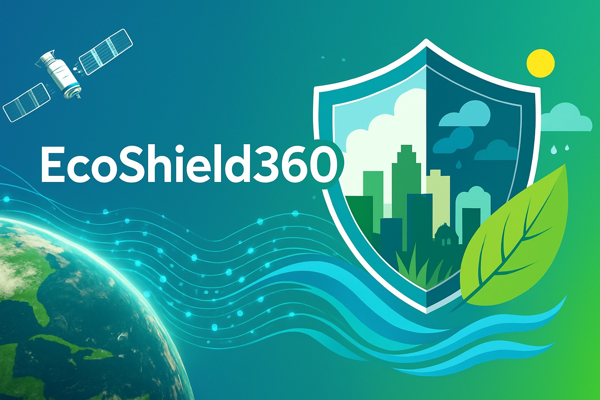

  
  <h2>
    Ecoshield360 🌱🌍
  </h2>

<h4 align="center">
  EcoShield360 is a mobile app that aims to create a platform that allows users to interact with the environment and the ecosystem in a more sustainable way.
</h4>
 

    
    
    
    

## Feature guide

Air qulity index

 

Geographical information of the air quality index. The app allows users to interact with the environment and the ecosystem in a more sustainable way.

> [!NOTE]  
> The preview will be available soon.

Vegetation health

 

Geographical information of the vegetation health. With this feature the user can interact with the plant health and the ecosystem in a more sustainable way.

> [!NOTE]  
> The preview will be available soon.

👥 Team

 

Team members and roles in the project: data analysis, visual development, and statistical modeling.

<table class="team-table">
    <tr>
        <th>Photo</th>
        <th>Name</th>
        <th>Role</th>
    </tr>
    <tr>
        <td></td>
        <td>Zaid Pantoja</td>
        <td>Data analysis - AI and Machine Learning</td>
    </tr>
    <tr>
        <td></td>
        <td>Santigo Cardenas </td>
        <td>Frontend tech lead - UI/UX design</td>
    </tr>
    <tr>
        <td></td>
        <td>Angel Ortega</td>
        <td>Backend architect - tech lead - automation and data processing</td>
    </tr>
    <tr>
        <td></td>
        <td>Andres Aviles</td>
        <td>Devops Manager - Dba and networking</td>
    </tr>
</table>

---

## Wiki

Do you **need some help**? Check out the _articles_ on the [wiki](https://github.com/Stellar-Colombian-Technology/EcoShield/wiki/).

## Contributing

Got **something interesting** you'd like to **share**? Learn about [contributing](/.github/CONTRIBUTING.md).

## Credits

|  |  |  |  |
|:--------------------------------------------------------------------------------------------------:|:-----------------------------------------------------------------------------------------------------------:|:------------------------------------------------------------------------------------------------------:|:------------------------------------------------------------------------------------------------------------:|
| **Angel-ISO**                                                                                      | **andresavilesdev**                                                                                         | **Alberthzaid**                                                                                         | **santiagocard123**                                                                                          |

<h2>
 License
</h2>

Licensed under Apache 2.0, see [LICENSE](/.github/LICENSE) for details.

---

## Support

If you need help with the project, please contact us at [stellarcolsupp@gmail.com](mailto:stellarcolsupp@gmail.com).

